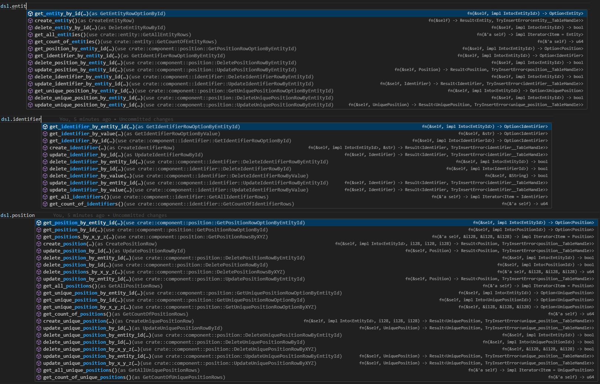
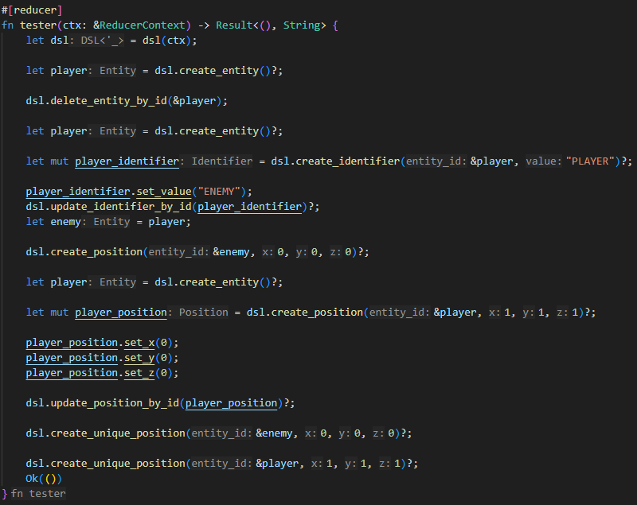

# *SpacetimeDSL*

*SpacetimeDSL* provides you a high-level [*D*omain *S*pecific *L*anguage (DSL)](https://en.wikipedia.org/wiki/Domain-specific_language) in Rust to interact in an ergonomic, more developer-friendly and type-safe way with the data in your [*SpacetimeDB*](https://spacetimedb.com/) instances.

Try SpacetimeDSL for yourself, by adding it to your server modules `Cargo.toml`:

```toml
# https://crates.io/crates/spacetimedsl Ergonomic DSL for SpacetimeDB
spacetimedsl = { version = "*" }
```

Get started by adding `#[spacetimedsl::dsl]` as well as it's helper attributes `#[create_wrapper]`, `#[use_wrapper]`,\
`#[foreign_key]` and `#[referenced_by]` to your structs with `#[spacetimedb::table]`!

If you've questions, consult the [FAQ](#faq) and if it's not answered there, you can find me in the [SpacetimeDSL channel of the SpacetimeDB Discord Server](https://discord.com/channels/1037340874172014652/1395832638966726726).

## Vanilla SpacetimeDB

Let's start with a ordinary SpacetimeDB schema:

```rust
#[spacetimedb::table(name = entity, public)]
pub struct Entity {
    #[primary_key]
    #[auto_inc]
    id: u128,

    created_at: spacetimedb::Timestamp,
}

#[spacetimedb::table(name = position, public, index(name = x_y, btree(columns = [x, y])))]
pub struct Position {
    #[primary_key]
    #[auto_inc]
    id: u128,

    #[unique]
    entity_id: u128,

    x: i128,

    y: i128,

    modified_at: spacetimedb::Timestamp,
}

```

We have two tables:

- The `Entity` table which holds no data per row except an unique machine-readable identifier and
- The `Position` table which holds an `entity_id`and a `x` and `y` value per row.

But even with this small data model, there are a few fundamental problems with vanilla SpacetimeDB:

- If you want to create an `Entity`, you have to pass an `Entity` to the DB's `insert`/`try_insert` method, which means you have to create one first. However, there are sensible defaults for all columns, namely `0` for the `id` column (to get an automatically incremented `id`) and `ctx.timestamp`, which is the current timestamp – boilerplate code that could be avoided.

- You are able to change the `created_at` value of an already created `Entity` and use the DB's `update`/`try_update` method to persist the data.

- The fact that the second column of the `Position` table is called `entity_id` does not mean that you can only enter IDs of `Entities` there ...

- ... and it certainly does not mean that these `Entities` actually exist ...

- ... and that `Positions` are deleted when `Entities` are deleted.

Based on the types of the `x` and `y` columns in the `Position` table, we could already guess that we are dealing with a tile-based 2D game.

- Each tile should only be able to contain a maximum of one `Entity` — we have to check this ourselves every time we make changes to the `Position` table, as there are no `unique multi-column indices`.

- In addition, we must change the `modified_at` column each time and store the correct data (`ctx.timestamp`) when we make changes to it.

SpacetimeDB is a great technology, but it still has some weaknesses that prevent developers from utilizing its full potential — sometimes they even have to work against the database.

## SpacetimeDB with SpacetimeDSL

Let's now have a look what happens when you're adding **SpacetimeDSL** to your tables...

```rust
#[spacetimedsl::dsl(plural_name = entities)]         // Added
#[spacetimedb::table(name = entity, public)]
pub struct Entity {
    #[primary_key]
    #[auto_inc]
    #[create_wrapper]                                // Added
    #[referenced_by(path = crate, table = position)] // Added
    id: u128,

    created_at: spacetimedb::Timestamp,
}

#[spacetimedsl::dsl(plural_name = positions, unique_index(name = x_y))]                     // Added
#[spacetimedb::table(name = position, public, index(name = x_y, btree(columns = [x, y])))]
pub struct Position {
    #[primary_key]
    #[auto_inc]
    #[create_wrapper]                                                                      // Added
    id: u128,

    #[unique]
    #[use_wrapper(EntityId)]
    #[foreign_key(path = crate, table = entity, on_delete = Delete)]                       // Added
    entity_id: u128,

    x: i128,

    y: i128,

    modified_at: spacetimedb::Timestamp,
}
```

> For clarity, the rest of this documentation uses **DB** to refer to **SpacetimeDB** and **DSL** to refer to **SpacetimeDSL**.

Looks like nothing much, but let's have a look what you can do now:

### The `Create` DSL method

```rust
#[spacetimedb::reducer]
pub fn create_example(ctx: &spacetimedb::ReducerContext) -> Result<(), String> {
    // Vanilla SpacetimeDB
    use spacetimedb::Table;

    // Without the question mark it would return a
    // Result<Entity, spacetimedb::TryInsertError<entity__TableHandle>>
    let entity: Entity = ctx.db.entity().try_insert(
        Entity {
            id: 0,
            created_at: ctx.timestamp,
        }
    )?;

    // SpacetimeDB with SpacetimeDSL
    let dsl: spacetimedsl::DSL<'_> = spacetimedsl::dsl(ctx);

    // Without the question mark it would return a Result<Entity, spacetimedsl::SpacetimeDSLError>
    let entity: Entity = dsl.create_entity()?;

    Ok(())
}
```

Ok, wow.

First and foremost: Your code is now much nicer to read and write!

The `Create` DSL Method didn't want you to create and supply an `Entity` in order to insert it into the database. That's because

- the `id` column has the `#[auto_inc]` attribute and

- the second column is named `created_at` and has the `spacetimedb::Timestamp` type.

The DSL automatically applies default values to them during creation:

- `0` for the `id` column (which means the ID is generated by the DB) and

- `ctx.timestamp` for the `created_at` column.

For `modified_at` columns, the DSL supports both `spacetimedb::Timestamp` and `Option<spacetimedb::Timestamp>` types, automatically setting the value to `ctx.timestamp` or `Some(ctx.timestamp)` respectively.

SpacetimeDSL wraps a `&spacetimedb::ReducerContext` and provides a more ergonomic API for it, including added capabilities to reduce boilerplate code.

Instances of the DSL can be created through the `spacetimedsl::dsl(ctx: &ReducerContext) -> DSL;` function, but you should do that only once at the beginning of every reducer.

Instead of passing the `&DSL` and the `&ReducerContext` to functions/methods, you should only pass the `&DSL` and use the `ctx()` method on it (if you really need to do that), which is defined by the `spacetimedb::DSLContext` trait.

Here is the implementation of the `Create` DSL method:

```rust
pub trait CreateEntityRow : spacetimedsl::DSLContext {
    fn create_entity<'a>(&'a self) -> Result<Entity, spacetimedsl::SpacetimeDSLError> {
        use spacetimedsl::Wrapper;
        use spacetimedb::{DbContext, Table};

        let id = u128::default();
        let created_at = self.ctx().timestamp;

        let entity = Entity { id, created_at };

        match self.ctx().db().entity().try_insert(entity) {
            Ok(entity) => Ok(entity),
            Err(error) => {
                match error {
                    spacetimedb::TryInsertError::UniqueConstraintViolation(_) => {
                        Err(spacetimedsl::SpacetimeDSLError::UniqueConstraintViolation {
                            table_name: "entity".into(),
                            action: spacetimedsl::Action::Create,
                            error_from: spacetimedsl::ErrorFrom::SpacetimeDB,
                            one_or_multiple: spacetimedsl::OneOrMultiple::One,
                            column_names_and_row_values: format!(
                                "{{ entity : {:?} }}",
                                entity
                            ).into(),
                        })
                    }
                    spacetimedb::TryInsertError::AutoIncOverflow(_) => {
                        Err(spacetimedsl::SpacetimeDSLError::AutoIncOverflow {
                            table_name: "entity".into(),
                        })
                    }
                }
            }
        }
    }
}

impl CreateEntityRow for spacetimedsl::DSL<'_> {}
```

### The `SpacetimeDSLError` Type

Have you already stumbled across `SpacetimeDSLError`? That's good! Unlike the errors the DB returns.

The DSL transforms them and adds metadata for better debugging capabilities.

DB methods which return

- a `spacetimedb::TryInsertError<entity__TableHandle>` (`Insert` and `Update`)

- a `bool` (`Delete One`),

- an `Option` (`Get One`) or

- an `u64` (`Delete Many`)

return `SpacetimeDSLError` in the DSL methods.

```rust
// Enum variant data omitted
pub enum SpacetimeDSLError {
    Error,                       // Not available in vanilla SpacetimeDB
    NotFoundError,               // Not available in vanilla SpacetimeDB
    UniqueConstraintViolation,
    AutoIncOverflow,
    ReferenceIntegrityViolation, // Not available in vanilla SpacetimeDB
}
```

#### The `Error` variant

Used in unpleasant moments with the DB, when even the DSL can't help you. If you encounter this error, never ever return an `Ok(())` in your reducer.

#### The `NotFoundError` variant

Where the DB would only return an ordinary `Option<T>`, the DSL gives you a `NotFound` error – including the name of the table and the values of the columns.

You would see them in the logs as following:

`Not Found Error while trying to find a row in the position table with {{ entity_id : 1 }}!`).

#### The `UniqueConstraintViolation` variant

This error can originate from both the DB (unique **single**-column indices) and the DSL (unique **multi**-column indices).

You've already seen how the DSL is transforming the error from the DB into it's own error type in the `Create` DSL method.

You would see them in the logs as following:

`Unique Constraint Violation Error while trying to create a row in the entity table! Unfortunately SpacetimeDB doesn't provide more information, so here are all columns and their values: {{ entity : Entity { id: EntityId { id: 1 }, created_at: /* omitted */ } }}`.

#### The `AutoIncOverflow` variant

It's the same error as the DB is currently returning (without the name of the column which caused it), but at least it returns the name of the table in the DSL.

You would see them in the logs as following:

`Auto Inc Overflow Error on the entity table! Unfortunately SpacetimeDB doesn't provide more information.`

#### The `ReferenceIntegrityViolation` variant

Is huge. You are able to encounter this error in two ways:

- When creating or updating rows in tables whose foreign keys reference primary keys of other tables (have one or multiple columns with `#[foreign_key]`) or

- when deleting rows in tables whose primary keys are referenced by foreign keys of other tables (have one or multiple `#[referenced_by]`s on the primary key column).

The first type is not particularly complex: If you create or update a row and set the value of a column that has a foreign key, the DSL method checks whether a row exists in the referenced table with the same value in its primary key column.

You would see them in the logs as following:

`Reference Integrity Violation Error while trying to create a row in the position table because of {{ entity_id : 1 }}!`

The second is more complex! Because:

### The `DeletionResult[Entry]` Type

**Developer** : "*Hi! It's me, a developer. I need an audit log about every deletion. How would I do that with you, **DB**?*"

**DB** : "*Eh...\
I can give you information about whether*

- *you've deleted a row or not (`bool` in `Delete One` methods) or*

- *how many rows you've deleted (`u64` in `Delete Many` methods).*

*Is that enough?*"

**DSL** : "*May I answer this question for you, **developer**?*"

**Developer** : "*Yes, please!*"

**DSL** : "*Okay, so **DB**, the answer is: No!*

*But don't worry, **developer**, I have a solution for you! Let me present to you:*"

The `DeletionResult` Type!

```rust
pub struct DeletionResult {
    pub table_name: Box<str>,
    pub one_or_multiple: OneOrMultiple,
    pub entries: Vec<DeletionResultEntry>,
}

pub struct DeletionResultEntry {
    pub table_name: Box<str>,
    pub column_name: Box<str>,
    pub strategy: OnDeleteStrategy,
    pub row_value: Box<str>,
    pub child_entries: Vec<DeletionResultEntry>,
}
```

If you're using the `Delete One` or `Delete Many` DSL methods, you get a `DeletionResult` on success as well as on failure.

You can use it directly to process it programmatically or use the `to_csv` method to log/persist it. You can then for example import it into your favorite spreadsheet application.

More on the creation of `DeletionResult`s also later in the docs section about [Foreign Keys and Referential Integrity](#foreign-keys--referential-integrity).

### The `OnDeleteStrategy` Type

You've seen it already in the `#[foreign_key]` attribute as well as in the `DeletionResultEntry` type.

It influences how the DSL should handle deletions of rows which are referenced by other rows.

The doc comments speak for themselves:

```rust
pub enum OnDeleteStrategy {
    /**
     * Available independent from the column type.
     * 
     * If a row of a table should be deleted whose primary key value is referenced in foreign keys ...
     * ... of other tables the deletion fails with a Reference Integrity Violation Error.
     */
    Error,

    /**
     * Available independent from the column type.
     * 
     * If a row of a table should be deleted whose primary key value is referenced in foreign keys ...
     * ... of other tables, it's checked whether any primary key value of rows to delete is referenced
     * in a foreign key with `OnDeleteStrategy::Error`.
     * 
     * If true, the deletion fails with a Reference Integrity Violation Error and
     * no other OnDeleteStrategy is executed (especially: no row is deleted).
     * 
     * If false, the on delete strategies of all affected rows are executed and rows are deleted.
     */
    Delete,

    /**
     * Available only for columns with a numeric type.
     * 
     * If a row of a table should be deleted whose primary key value is referenced in foreign keys ...
     * ... of other tables the value of the foreign key column is set to `0`.
     */
    SetZero,

    /**
     * Available independent from the column type.
     * 
     * If a row of a table should be deleted whose primary key value is referenced in foreign keys ...
     * ... of other tables nothing happens, which means the referencing rows will reference a primary
     * key value which doesn't exist anymore. The referential integrity is only enforced while creating
     * a row or if a row is updated and the foreign key column value is changed.
     */
    Ignore,
}
```

### The `#[create_wrapper]` and `#[use_wrapper]` attributes - aka Wrapper Types

Every column with

- `#[primary_key]`,

- `#[unique]` or

- `#[index]`

attribute requires a

- `#[create_wrapper]` or

- `#[use_wrapper]`

attribute.

The DSL generates [unique, auto-generated alias types](https://medium.com/unil-ci-software-engineering/clean-ddd-lessons-modeling-identity-ff8bc17e0ae6#:~:text=We%20should%20not%20use%20primitives) for these columns.

They're called `Wrapper Types` because they're decreasing [primitive obsession](https://refactoring.guru/smells/primitive-obsession) by wrapping primitive column types.

[Logical dependencies become physical ones](https://medium.com/@gara.mohamed/domain-driven-design-the-identifier-type-pattern-d86fd3c128b3#:~:text=Make%20logical%20dependencies%20physical) and [reversing the order of fields (e.g. of multi-column indices) results in compilation-errors instead of runtime-errors when accessing them](https://medium.com/@gara.mohamed/domain-driven-design-the-identifier-type-pattern-d86fd3c128b3#:~:text=Suppose%20that%20we,at%20compile%20time.).

This is their API:

```rust
pub trait Wrapper<WrappedType: Clone + Default, WrapperType>: Default +
    Clone + PartialEq + PartialOrd + spacetimedb::SpacetimeType + Display
{
    fn new(value: WrappedType) -> WrapperType;
    fn value(&self) -> WrappedType;
}
```

The difference between `#[create_wrapper]` and `#[use_wrapper]` is that the first is creating a new `Wrapper Type` while the second is using one which is already generated by another column (in a possibly foreign table).

```rust
#[spacetimedsl::dsl(plural_name = entities)]
#[spacetimedb::table(name = entity, public)]
pub struct Entity {
    // Default Name Strategy: EntityId
    // format!("{}{}", singular_table_name_pascal_case, column_name_pascal_case)
    #[create_wrapper]

    //  Custom Name Strategy: EntityID
    #[create_wrapper(EntityID)]

    id: u128,

    // Use a wrapper type from the same module
    #[use_wrapper(EntityId)]

    // Use a wrapper type from another module
    #[use_wrapper(crate::entity::EntityId)]

    parent_entity_id: u128,
}
```

If you encounter an compilation error like:

The trait bound `WrapperType: From<NumericType>` is not satisifed.\
The trait `From<NumericType>` is not implemented for `WrapperType`.\
But trait `From<&TableType>` is implemented fort it.\
For that trait implementation, expected `&TableType`, found `NumericType`.\
Required for `NumericType` to implement `Into<WrapperType>`

this means that you've provided a `NumericType` (like `u128`) as argument where a `WrapperType` is required.

It's a common limitation of the SpacetimeDB CLI and the [Admin Panel](https://github.com/JulienLavocat/SpacetimeDB-Admin/) that they don't support custom, non-primitive types - they are affected by primitive obsession. Therefore they have no feature-parity with SpacetimeDB server modules. SpacetimeDSL tries to increase the developer experience and uses the full capacities of SpacetimeDB for it, which are supported by SpacetimeDB clients.

That said: If you're creating a Wrapper Type object yourself (`WrapperType::new(wrapped_type)`) you're doing something what you shouldn't do, because the whole ecosystem around your server modules should incorporate the `Wrapper Types` into their API (e. g. reducer arguments) to not be obsessed by the primitive types which they wrap.

### Accessors (Getters and Setters)

For any column of a table, a public getter is generated. It returns either a reference to the rows value for the column or if it's a wrapped type it clones the value and creates a new instance of the Wrapper Type.

For any column in the table **which is not private**, a setter with the visibility of the column is generated. So you can use the visibility of fields to describe that a field value should never change after creating a row.

**Automatic Field Privacy Enforcement**: SpacetimeDSL automatically makes all struct fields private when the last DSL attribute is processed. This ensures that developers cannot access struct members directly and must always use the generated wrapper types, getters, and setters. This prevents unauthorized field modifications after initialization and enforces proper encapsulation.

This is useful for e. g.

- primary- and foreign key columns, which possibly should never change, as well as

- a `created_at` column or

- an event table for auditing purposes whose data should never change after creation.

If all of your table columns are private, **no** `Update` DSL method will be generated, because you said through that, that the row should never change after its insertion.

(If <https://github.com/rust-lang/rust/issues/105077> is released, the DSL will use the field mutability restrictions instead of the visibility to decide whether or not to generate setters)

### Unique multi-column indices

[SpacetimeDSL](https://github.com/tamaro-skaljic/SpacetimeDSL/issues/25) has implemented unique multi-column indices before [SpacetimeDB](https://github.com/clockworklabs/SpacetimeDB/issues/976).

Here is an example:

```rust
#[dsl(
    plural_name = entity_relationships,
    unique_index(name = parent_child_entity_id)
)]
#[table(
    name = entity_relationship,
    public,
    index(name = parent_child_entity_id, btree(columns = [parent_entity_id, child_entity_id]))
)]
pub struct EntityRelationship {
    #[primary_key]
    #[auto_inc]
    id: u128,

    parent_entity_id: u128,

    child_entity_id: u128,
}
```

As you can see, you just need

- to add `unique_index(name = parent_child_entity_id)`

- to your `#[spacetimedsl::dsl(plural_name = entity_relationships)]` attribute macro and

- have a multi-column index on your `#[spacetimedb::table]` with the same name.

You'll have the

- `Get One`,

- `Update` and

- `Delete One`

DSL methods now instead of the

- `Get Many` and

- `Delete Many`

DSL methods. And if you're creating or updating a row, the DSL checks whether you're violating any unique multi-column index (while the DB checks all unique single-column indices).

Keep in mind that the unique multi-column indices which the DSL provides are only enforced if you never call DB state mutating methods on the `&spacetimedb::ReducerContext` yourself (insert, update, delete) - so only use the `&spacetimedsl::DSL` methods.

This feature is unstable and will be removed if the DB has implemented it's own unique multi column index feature.

### Foreign Keys / Referential Integrity

You can add `#[foreign_key]` and `#[referenced_by]` to your table columns to enforce referential integrity and apply on delete strategies.

Here is a example which is using both:

```rust
pub mod entity {
    #[dsl(plural_name = entities)]
    #[table(name = entity, public)]
    pub struct Entity {
        #[primary_key]
        #[auto_inc]
        #[create_wrapper]
        #[referenced_by(path = crate, table = identifier)] // Added
        id: u128,

        created_at: Timestamp,
    }
}

pub mod identifier {
    #[dsl(plural_name = identifiers)]
    #[table(name = identifier, public)]
    pub struct Identifier {
        #[primary_key]
        #[auto_inc]
        #[create_wrapper]
        #[referenced_by(path = crate, table = identifier_reference)]     // Added
        id: u128

        #[unique]
        #[use_wrapper(crate::EntityId)]
        #[foreign_key(path = crate, table = entity, on_delete = Delete)] // Added
        entity_id: u128

        #[unique]
        pub value: String

        created_at: Timestamp

        modified_at: Timestamp,
    }
}

#[dsl(plural_name = identifier_references)]
#[table(name = identifier_reference, public)]
pub struct IdentifierReference {
    #[primary_key]
    #[use_wrapper(IdentifierId)]
    #[foreign_key(path = crate, table = identifier, on_delete = Error)]   // Added
    id: u128,

    #[unique]
    #[use_wrapper(IdentifierId)]
    #[foreign_key(path = crate, table = identifier, on_delete = Delete)]  // Added
    id2: u128,

    #[unique]
    #[use_wrapper(IdentifierId)]
    #[foreign_key(path = crate, table = identifier, on_delete = SetZero)] // Added
    id3: u128,

    #[unique]
    #[use_wrapper(IdentifierId)]
    #[foreign_key(path = crate, table = identifier, on_delete = Ignore)]  // Added
    id4: u128,
}
```

The `#[referenced_by]` attribute needs values for the `path` and `table` fields and is only allowed on `#[primary_key]` columns (which require `#[create_wrapper]`/`#[use_wrapper]`).

You can add multiple `#[referenced_by]`'s to the same primary key column, but you need one for each table which has a `#[foreign_key]` referencing the table (see the pk column of the entity table).

`#[referenced_by]`'s are responsible for calling the `OnDeleteStrategy`'s of tables which reference them though a `#[foreign_key]`, that means it's influencing the `Delete One` and `Delete Many` DSL methods.

`#[foreign_key]`'s are only allowed on columns with `#[primary_key]`, `#[index]` or `#[unique]`.

They require the `#[use_wrapper]` attribute and you need a value for the `path`, `table`, `column` and `on_delete` fields.

Only one `#[foreign_key]` is allowed per column.

`#[foreign_key]`s are responsible for referential integrity checks when creating or updating rows as well as executing the `OnDeleteStrategy` if a row of the referenced table is deleted.

Keep in mind that the referential integrity which the DSL provides is only enforced if you never call DB state mutating methods on the `&spacetimedb::ReducerContext` yourself (insert, update, delete) - so only use the `&spacetimedsl::DSL` methods.

This feature is unstable. First it will be removed if SpacetimeDB has implemented it's own referential integrity / foreign key features, second there are tests to ensure referential integrity, but there may be cases which aren't tested yet. Make backups of your data before testing the feature and PLEASE, if you find any bug, create a GitHub issue!

<details>

<summary>Here is the `Delete One` DSL method of the Entity table</summary>

```rust
pub trait DeleteEntityRowById: spacetimedsl::DSLContext {
    fn delete_entity_by_id(
        &self,
        id: impl Into<EntityId> + Clone,
    ) -> Result<spacetimedsl::DeletionResult, spacetimedsl::SpacetimeDSLError> {
        use spacetimedsl::Wrapper;
        use spacetimedb::{DbContext, Table};
        use spacetimedsl::itertools::Itertools;

        let id = id.clone().into().value();

        let row_to_delete = self.ctx().db().entity().id().find(id);

        let primary_key_value_of_a_row_to_delete = match row_to_delete {
            None => {
                return Err(spacetimedsl::SpacetimeDSLError::NotFoundError {
                    table_name: "entity".into(),
                    column_names_and_row_values: format!("{{ , id : {0}  }}", &id).into(),
                });
            }
            Some(row_to_delete) => row_to_delete.id,
        };

        let mut deletion_result_entry = spacetimedsl::DeletionResultEntry {
            table_name: "entity".into(),
            column_name: "id".into(),
            strategy: spacetimedsl::OnDeleteStrategy::Delete,
            row_value: format!("{0}", EntityId::new(primary_key_value_of_a_row_to_delete.clone())).into(),
            child_entries: vec![],
        };

        match spacetimedsl::internal::DSLInternals::execute_on_delete_strategies_of_referencing_tables_after_one_row_of_the_entity_table_was_deleted(
            self.ctx(),
            spacetimedsl::OnDeleteStrategy::Error,
            &primary_key_value_of_a_row_to_delete,
        ) {
            Err(mut child_entries) => {
                deletion_result_entry.child_entries.append(&mut child_entries);
                let error = spacetimedsl::DeletionResult {
                    table_name: "entity".into(),
                    one_or_multiple: spacetimedsl::OneOrMultiple::One,
                    entries: vec![deletion_result_entry],
                };
                return Err(
                    spacetimedsl::SpacetimeDSLError::ReferenceIntegrityViolation(
                        spacetimedsl::ReferenceIntegrityViolationError::OnDelete(
                            error,
                        ),
                    ),
                );
            }
            Ok(mut child_entries) => {
                deletion_result_entry.child_entries.append(&mut child_entries);
            }
        };

        match self
            .ctx()
            .db()
            .entity()
            .id()
            .delete(primary_key_value_of_a_row_to_delete)
        {
            false => return Err(spacetimedsl::SpacetimeDSLError::Error("Delete One Error: `count_of_rows_to_delete ( 1 ) != ( 0 ) count_of_deleted_rows`!".to_string())),
            true => {}
        };

        match spacetimedsl::internal::DSLInternals::execute_on_delete_strategies_of_referencing_tables_after_one_row_of_the_entity_table_was_deleted(
            self.ctx(),
            spacetimedsl::OnDeleteStrategy::Delete,
            &primary_key_value_of_a_row_to_delete,
        ) {
            Err(mut child_entries) => {
                deletion_result_entry.child_entries.append(&mut child_entries);
                let error = spacetimedsl::DeletionResult {
                    table_name: "entity".into(),
                    one_or_multiple: spacetimedsl::OneOrMultiple::One,
                    entries: vec![deletion_result_entry],
                };
                return Err(
                    spacetimedsl::SpacetimeDSLError::Error(
                        format!("Delete One Error: An unknown error occurred after changing the database state! If the reducer running this doesn\'t return an error, the state changes are persisted and you have problems now! Here is the deletion result: {0}", error),
                    ),
                );
            }
            Ok(mut child_entries) => {
                deletion_result_entry.child_entries.append(&mut child_entries);
            }
        };

        match spacetimedsl::internal::DSLInternals::execute_on_delete_strategies_of_referencing_tables_after_one_row_of_the_entity_table_was_deleted(
            self.ctx(),
            spacetimedsl::OnDeleteStrategy::SetZero,
            &primary_key_value_of_a_row_to_delete,
        ) {
            Err(mut child_entries) => {
                deletion_result_entry.child_entries.append(&mut child_entries);
                let error = spacetimedsl::DeletionResult {
                    table_name: "entity".into(),
                    one_or_multiple: spacetimedsl::OneOrMultiple::One,
                    entries: vec![deletion_result_entry],
                };
                return Err(
                    spacetimedsl::SpacetimeDSLError::Error(
                        format!("Delete One Error: An unknown error occurred after changing the database state! If the reducer running this doesn\'t return an error, the state changes are persisted and you have problems now! Here is the deletion result: {0}", error),
                    ),
                );
            }
            Ok(mut child_entries) => {
                deletion_result_entry.child_entries.append(&mut child_entries);
            }
        };

        match spacetimedsl::internal::DSLInternals::execute_on_delete_strategies_of_referencing_tables_after_one_row_of_the_entity_table_was_deleted(
            self.ctx(),
            spacetimedsl::OnDeleteStrategy::Ignore,
            &primary_key_value_of_a_row_to_delete,
        ) {
            Err(mut child_entries) => {
                deletion_result_entry.child_entries.append(&mut child_entries);
                let error = spacetimedsl::DeletionResult {
                    table_name: "entity".into(),
                    one_or_multiple: spacetimedsl::OneOrMultiple::One,
                    entries: vec![deletion_result_entry],
                };
                return Err(
                    spacetimedsl::SpacetimeDSLError::Error(
                        format!("Delete One Error: An unknown error occurred after changing the database state! If the reducer running this doesn\'t return an error, the state changes are persisted and you have problems now! Here is the deletion result: {0}"error),
                    ),
                );
            }
            Ok(mut child_entries) => {
                deletion_result_entry.child_entries.append(&mut child_entries);
            }
        };

        return Ok(spacetimedsl::DeletionResult {
            table_name: "entity".into(),
            one_or_multiple: spacetimedsl::OneOrMultiple::One,
            entries: vec![deletion_result_entry],
        });
    }
}
impl DeleteEntityRowById for spacetimedsl::DSL<'_> {}
```

</details>

The `Delete One` and `Delete Many` DSL methods call internal functions,
which are generated by tables with `#[referenced_by]`'s.

#### Internals

> You don't need to know that. If you want, keep reading, if not jump to [the plural name DSL attribute field](#the-plural-name-dsl-attribute-field).

They are called more than one time to ensure that `OnDeleteStrategy::Error` is always processed first.

There is one implementation which is called if

- one row of the referenced table should be deleted and

one which is called if

- multiple rows of the referenced table should be deleted.

They're the same except that the one for multiple rows has

- a `&'a [PrimaryKeyType]` instead of a `&PrimaryKeyType` parameter and
- a `std::collections::HashMap<&'a u128, Vec<spacetimedsl::DeletionResultEntry>>` instead of a `Vec<spacetimedsl::DeletionResultEntry>` return type.

<details>

<summary>Let's have a look at the function for the multiple rows</summary>

```rust
pub trait ExecuteOnDeleteStrategiesOfReferencingTablesAfterMultipleRowsOfTheEntityTableWereDeleted {
    fn execute_on_delete_strategies_of_referencing_tables_after_multiple_rows_of_the_entity_table_were_deleted<'a>(
        ctx: &spacetimedb::ReducerContext,
        strategy: spacetimedsl::OnDeleteStrategy,
        primary_key_values_of_rows_to_delete: &'a [u128],
    ) -> Result<
        std::collections::HashMap<&'a u128, Vec<spacetimedsl::DeletionResultEntry>>,
        std::collections::HashMap<&'a u128, Vec<spacetimedsl::DeletionResultEntry>>,
    > {
        use spacetimedsl::Wrapper;
        use spacetimedb::{DbContext, Table};

        let mut entries = std::collections::HashMap::new();

        for primary_key_value_of_a_row_to_delete in primary_key_values_of_rows_to_delete {
            entries.insert(primary_key_value_of_a_row_to_delete, vec![]);
        }

        let mut error = false;

        use crate::component::identifier::ExecuteOnDeleteStrategiesOfTheIdentifierTableAfterMultipleRowsOfTheEntityTableWereDeleted;
        match spacetimedsl::internal::DSLInternals::execute_on_delete_strategies_of_the_identifier_table_after_multiple_rows_of_the_entity_table_were_deleted(
            ctx,
            &strategy,
            primary_key_values_of_rows_to_delete,
        ) {
            Err(child_entries_by_primary_key_value_of_a_row_to_delete) => {
                for (primary_key_value_of_a_row_to_delete, mut child_entries) in child_entries_by_primary_key_value_of_a_row_to_delete {
                    entries.get_mut(&primary_key_value_of_a_row_to_delete).unwrap().append(&mut child_entries);
                }
                error = true;
            }
            Ok(child_entries_by_primary_key_value_of_a_row_to_delete) => {
                for (primary_key_value_of_a_row_to_delete, mut child_entries) in child_entries_by_primary_key_value_of_a_row_to_delete {
                    entries.get_mut(&primary_key_value_of_a_row_to_delete).unwrap().append(&mut child_entries);
                }
            }
        };

        match error {
            false => Ok(entries),
            true => Err(entries),
        }
    }
}
impl ExecuteOnDeleteStrategiesOfReferencingTablesAfterMultipleRowsOfTheEntityTableWereDeleted for spacetimedsl::internal::DSLInternals {}
```

</details>

As you can see it's calling another internal function,
which is generated by the `Identifier` table(because it has a `#[foreign_key]`) attribute.

<details>

<summary>Let's have a look into the one created by the `Identifier` table</summary>

```rust
pub trait ExecuteOnDeleteStrategiesOfTheIdentifierTableAfterMultipleRowsOfTheEntityTableWereDeleted {
    fn execute_on_delete_strategies_of_the_identifier_table_after_multiple_rows_of_the_entity_table_were_deleted<'a>(
        ctx: &spacetimedb::ReducerContext,
        strategy: &spacetimedsl::OnDeleteStrategy,
        primary_key_values_of_rows_of_another_table_to_delete: &'a [u128],
    ) -> Result<
        std::collections::HashMap<&'a u128, Vec<spacetimedsl::DeletionResultEntry>>,
        std::collections::HashMap<&'a u128, Vec<spacetimedsl::DeletionResultEntry>>,
        >,
    > {
        use spacetimedsl::Wrapper;
        use spacetimedb::{DbContext, Table};
        use spacetimedsl::itertools::Itertools;

        let mut entries = std::collections::HashMap::new();

        for primary_key_value_of_a_row_of_another_table_to_delete in primary_key_values_of_rows_of_another_table_to_delete {
            entries.insert(primary_key_value_of_a_row_of_another_table_to_delete, vec![]);
        }

        let mut error = false;

        match &strategy {
            spacetimedsl::OnDeleteStrategy::Ignore => {}
            spacetimedsl::OnDeleteStrategy::Delete => {
                let mut child_entries_by_primary_key_value_of_row_to_delete = std::collections::HashMap::new();

                let mut primary_key_values_of_rows_to_delete_by_primary_key_value_of_a_row_of_another_table_to_delete = std::collections::HashMap::new();
                
                for primary_key_value_of_a_row_of_another_table_to_delete in primary_key_values_of_rows_of_another_table_to_delete {
                    primary_key_values_of_rows_to_delete_by_primary_key_value_of_a_row_of_another_table_to_delete
                        .insert(primary_key_value_of_a_row_of_another_table_to_delete, vec![]);
                }

                for primary_key_value_of_a_row_of_another_table_to_delete in primary_key_values_of_rows_of_another_table_to_delete {
                    match ctx.db().identifier().entity_id().find(primary_key_value_of_a_row_of_another_table_to_delete)
                    {
                        None => {}
                        Some(row) => {
                            if !child_entries_by_primary_key_value_of_row_to_delete.contains_key(&row.id) {
                                primary_key_values_of_rows_to_delete_by_primary_key_value_of_a_row_of_another_table_to_delete
                                    .get_mut(primary_key_value_of_a_row_of_another_table_to_delete)
                                    .unwrap()
                                    .push(row.id);
                                child_entries_by_primary_key_value_of_row_to_delete.insert(row.id, vec![]);
                            }
                        }
                    };
                }

                let primary_key_values_of_rows_to_delete = child_entries_by_primary_key_value_of_row_to_delete
                    .keys()
                    .cloned()
                    .collect_vec();
                
                match spacetimedsl::internal::DSLInternals::execute_on_delete_strategies_of_referencing_tables_after_multiple_rows_of_the_identifier_table_were_deleted(
                    ctx,
                    spacetimedsl::OnDeleteStrategy::Error,
                    &primary_key_values_of_rows_to_delete[..],
                ) {
                    Err(
                        child_entries_by_primary_key_value_of_a_row_to_delete,
                    ) => {
                        error = true;
                        for (
                            primary_key_value_of_a_row_to_delete,
                            mut child_entries,
                        ) in child_entries_by_primary_key_value_of_a_row_to_delete {
                            child_entries_by_primary_key_value_of_row_to_delete
                                .get_mut(primary_key_value_of_a_row_to_delete)
                                .unwrap()
                                .append(&mut child_entries);
                        }
                    }
                    Ok(child_entries_by_primary_key_value_of_a_row_to_delete) => {
                        for (
                            primary_key_value_of_a_row_to_delete,
                            mut child_entries,
                        ) in child_entries_by_primary_key_value_of_a_row_to_delete {
                            child_entries_by_primary_key_value_of_row_to_delete
                                .get_mut(primary_key_value_of_a_row_to_delete)
                                .unwrap()
                                .append(&mut child_entries);
                        }
                    }
                };
                match error {
                    false => {}
                    true => {
                        for (
                            primary_key_value_of_a_row_of_another_table_to_delete,
                            primary_key_values_of_rows_to_delete,
                        ) in primary_key_values_of_rows_to_delete_by_primary_key_value_of_a_row_of_another_table_to_delete {
                            for id in &primary_key_values_of_rows_to_delete {
                                let child_entries = child_entries_by_primary_key_value_of_row_to_delete
                                    .remove(&id)
                                    .unwrap();
                                entries
                                    .get_mut(
                                        primary_key_value_of_a_row_of_another_table_to_delete,
                                    )
                                    .unwrap()
                                    .push(spacetimedsl::DeletionResultEntry {
                                        table_name: "identifier".into(),
                                        column_name: "entity_id".into(),
                                        strategy: spacetimedsl::OnDeleteStrategy::Delete,
                                        row_value: format!("{0}", IdentifierId::new(id.clone())).into(),
                                        child_entries,
                                    });
                            }
                        }
                        return Err(entries);
                    }
                };
                for id in &primary_key_values_of_rows_to_delete {
                    ctx.db().identifier().id().delete(id);
                }
                match error {
                    false => {}
                    true => {
                        for (
                            primary_key_value_of_a_row_of_another_table_to_delete,
                            primary_key_values_of_rows_to_delete,
                        ) in primary_key_values_of_rows_to_delete_by_primary_key_value_of_a_row_of_another_table_to_delete {
                            for id in &primary_key_values_of_rows_to_delete {
                                let child_entries = child_entries_by_primary_key_value_of_row_to_delete
                                    .remove(&id)
                                    .unwrap();
                                entries
                                    .get_mut(
                                        primary_key_value_of_a_row_of_another_table_to_delete,
                                    )
                                    .unwrap()
                                    .push(spacetimedsl::DeletionResultEntry {
                                        table_name: "identifier".into(),
                                        column_name: "entity_id".into(),
                                        strategy: spacetimedsl::OnDeleteStrategy::Delete,
                                        row_value: format!("{0}", IdentifierId::new(id.clone())).into(),
                                        child_entries,
                                    });
                            }
                        }
                        return Err(entries);
                    }
                };
                match spacetimedsl::internal::DSLInternals::execute_on_delete_strategies_of_referencing_tables_after_multiple_rows_of_the_identifier_table_were_deleted(
                    ctx,
                    spacetimedsl::OnDeleteStrategy::Delete,
                    &primary_key_values_of_rows_to_delete[..],
                ) {
                    Err(
                        child_entries_by_primary_key_value_of_a_row_to_delete,
                    ) => {
                        error = true;
                        for (
                            primary_key_value_of_a_row_to_delete,
                            mut child_entries,
                        ) in child_entries_by_primary_key_value_of_a_row_to_delete {
                            child_entries_by_primary_key_value_of_row_to_delete
                                .get_mut(primary_key_value_of_a_row_to_delete)
                                .unwrap()
                                .append(&mut child_entries);
                        }
                    }
                    Ok(child_entries_by_primary_key_value_of_a_row_to_delete) => {
                        for (
                            primary_key_value_of_a_row_to_delete,
                            mut child_entries,
                        ) in child_entries_by_primary_key_value_of_a_row_to_delete {
                            child_entries_by_primary_key_value_of_row_to_delete
                                .get_mut(primary_key_value_of_a_row_to_delete)
                                .unwrap()
                                .append(&mut child_entries);
                        }
                    }
                };
                match error {
                    false => {}
                    true => {
                        for (
                            primary_key_value_of_a_row_of_another_table_to_delete,
                            primary_key_values_of_rows_to_delete,
                        ) in primary_key_values_of_rows_to_delete_by_primary_key_value_of_a_row_of_another_table_to_delete {
                            for id in &primary_key_values_of_rows_to_delete {
                                let child_entries = child_entries_by_primary_key_value_of_row_to_delete
                                    .remove(&id)
                                    .unwrap();
                                entries
                                    .get_mut(
                                        primary_key_value_of_a_row_of_another_table_to_delete,
                                    )
                                    .unwrap()
                                    .push(spacetimedsl::DeletionResultEntry {
                                        table_name: "identifier".into(),
                                        column_name: "entity_id".into(),
                                        strategy: spacetimedsl::OnDeleteStrategy::Delete,
                                        row_value: format!("{0}", IdentifierId::new(id.clone())).into(),
                                        child_entries,
                                    });
                            }
                        }
                        return Err(entries);
                    }
                };
                match error {
                    false => {}
                    true => {
                        for (
                            primary_key_value_of_a_row_of_another_table_to_delete,
                            primary_key_values_of_rows_to_delete,
                        ) in primary_key_values_of_rows_to_delete_by_primary_key_value_of_a_row_of_another_table_to_delete {
                            for id in &primary_key_values_of_rows_to_delete {
                                let child_entries = child_entries_by_primary_key_value_of_row_to_delete
                                    .remove(&id)
                                    .unwrap();
                                entries
                                    .get_mut(
                                        primary_key_value_of_a_row_of_another_table_to_delete,
                                    )
                                    .unwrap()
                                    .push(spacetimedsl::DeletionResultEntry {
                                        table_name: "identifier".into(),
                                        column_name: "entity_id".into(),
                                        strategy: spacetimedsl::OnDeleteStrategy::Delete,
                                        row_value: format!("{0}", IdentifierId::new(id.clone())).into(),
                                        child_entries,
                                    });
                            }
                        }
                        return Err(entries);
                    }
                };
                match spacetimedsl::internal::DSLInternals::execute_on_delete_strategies_of_referencing_tables_after_multiple_rows_of_the_identifier_table_were_deleted(
                    ctx,
                    spacetimedsl::OnDeleteStrategy::SetZero,
                    &primary_key_values_of_rows_to_delete[..],
                ) {
                    Err(
                        child_entries_by_primary_key_value_of_a_row_to_delete,
                    ) => {
                        error = true;
                        for (
                            primary_key_value_of_a_row_to_delete,
                            mut child_entries,
                        ) in child_entries_by_primary_key_value_of_a_row_to_delete {
                            child_entries_by_primary_key_value_of_row_to_delete
                                .get_mut(primary_key_value_of_a_row_to_delete)
                                .unwrap()
                                .append(&mut child_entries);
                        }
                    }
                    Ok(child_entries_by_primary_key_value_of_a_row_to_delete) => {
                        for (
                            primary_key_value_of_a_row_to_delete,
                            mut child_entries,
                        ) in child_entries_by_primary_key_value_of_a_row_to_delete {
                            child_entries_by_primary_key_value_of_row_to_delete
                                .get_mut(primary_key_value_of_a_row_to_delete)
                                .unwrap()
                                .append(&mut child_entries);
                        }
                    }
                };
                match error {
                    false => {}
                    true => {
                        for (
                            primary_key_value_of_a_row_of_another_table_to_delete,
                            primary_key_values_of_rows_to_delete,
                        ) in primary_key_values_of_rows_to_delete_by_primary_key_value_of_a_row_of_another_table_to_delete {
                            for id in &primary_key_values_of_rows_to_delete {
                                let child_entries = child_entries_by_primary_key_value_of_row_to_delete
                                    .remove(&id)
                                    .unwrap();
                                entries
                                    .get_mut(
                                        primary_key_value_of_a_row_of_another_table_to_delete,
                                    )
                                    .unwrap()
                                    .push(spacetimedsl::DeletionResultEntry {
                                        table_name: "identifier".into(),
                                        column_name: "entity_id".into(),
                                        strategy: spacetimedsl::OnDeleteStrategy::Delete,
                                        row_value: format!("{0}", IdentifierId::new(id.clone())).into(),
                                        child_entries,
                                    });
                            }
                        }
                        return Err(entries);
                    }
                };
                match spacetimedsl::internal::DSLInternals::execute_on_delete_strategies_of_referencing_tables_after_multiple_rows_of_the_identifier_table_were_deleted(
                    ctx,
                    spacetimedsl::OnDeleteStrategy::Ignore,
                    &primary_key_values_of_rows_to_delete[..],
                ) {
                    Err(
                        child_entries_by_primary_key_value_of_a_row_to_delete,
                    ) => {
                        error = true;
                        for (
                            primary_key_value_of_a_row_to_delete,
                            mut child_entries,
                        ) in child_entries_by_primary_key_value_of_a_row_to_delete {
                            child_entries_by_primary_key_value_of_row_to_delete
                                .get_mut(primary_key_value_of_a_row_to_delete)
                                .unwrap()
                                .append(&mut child_entries);
                        }
                    }
                    Ok(child_entries_by_primary_key_value_of_a_row_to_delete) => {
                        for (
                            primary_key_value_of_a_row_to_delete,
                            mut child_entries,
                        ) in child_entries_by_primary_key_value_of_a_row_to_delete {
                            child_entries_by_primary_key_value_of_row_to_delete
                                .get_mut(primary_key_value_of_a_row_to_delete)
                                .unwrap()
                                .append(&mut child_entries);
                        }
                    }
                };
                for (
                    primary_key_value_of_a_row_of_another_table_to_delete,
                    primary_key_values_of_rows_to_delete,
                ) in primary_key_values_of_rows_to_delete_by_primary_key_value_of_a_row_of_another_table_to_delete {
                    for id in &primary_key_values_of_rows_to_delete {
                        let child_entries = child_entries_by_primary_key_value_of_row_to_delete
                            .remove(&id)
                            .unwrap();
                        entries
                            .get_mut(
                                primary_key_value_of_a_row_of_another_table_to_delete,
                            )
                            .unwrap()
                            .push(spacetimedsl::DeletionResultEntry {
                                table_name: "identifier".into(),
                                column_name: "entity_id".into(),
                                strategy: spacetimedsl::OnDeleteStrategy::Delete,
                                row_value: ::alloc::__export::must_use({
                                        ::alloc::fmt::format(
                                            format_args!("{0}", IdentifierId::new(id.clone())),
                                        )
                                    })
                                    .into(),
                                child_entries,
                            });
                    }
                }
            }
            spacetimedsl::OnDeleteStrategy::Error => {}
            spacetimedsl::OnDeleteStrategy::SetZero => {}
        };
        match error {
            false => Ok(entries),
            true => Err(entries),
        }
    }
}
impl ExecuteOnDeleteStrategiesOfTheIdentifierTableAfterMultipleRowsOfTheEntityTableWereDeleted for spacetimedsl::internal::DSLInternals {}
```

</details>

Because the `Identifier` table is referenced by the `Identifier Reference` table, it does much during execution of the `OnDeleteStrategy::Delete` strategy.

It calls it's own function generated because it has at least one `#[referenced_by]`.

This method is like the one before, except that it calls the function of the `Identifier Reference` table.

<details>

<summary>Let's have a look into it (which doesn't do that much stuff in the <code>OnDeleteStrategy::Delete</code> match arm as the one for the <code>Identifier</code> table)</summary>

```rust
pub trait ExecuteOnDeleteStrategiesOfTheIdentifierReferenceTableAfterMultipleRowsOfTheIdentifierTableWereDeleted {
    fn execute_on_delete_strategies_of_the_identifier_reference_table_after_multiple_rows_of_the_identifier_table_were_deleted<'a>(
        ctx: &spacetimedb::ReducerContext,
        strategy: &spacetimedsl::OnDeleteStrategy,
        primary_key_values_of_rows_of_another_table_to_delete: &'a [u128],
    ) -> Result<
        std::collections::HashMap<&'a u128, Vec<spacetimedsl::DeletionResultEntry>>,
        std::collections::HashMap<&'a u128, Vec<spacetimedsl::DeletionResultEntry>>,
    > {
        use spacetimedsl::Wrapper;
        use spacetimedb::{DbContext, Table};
        use spacetimedsl::itertools::Itertools;

        let mut entries = std::collections::HashMap::new();

        for primary_key_value_of_a_row_of_another_table_to_delete in primary_key_values_of_rows_of_another_table_to_delete {
            entries.insert(primary_key_value_of_a_row_of_another_table_to_delete, vec![]);
        }

        let mut error = false;

        match &strategy {
            spacetimedsl::OnDeleteStrategy::Error => {
                for primary_key_value_of_a_row_of_another_table_to_delete in primary_key_values_of_rows_of_another_table_to_delete {
                    match ctx.db().identifier_reference().id().find(primary_key_value_of_a_row_of_another_table_to_delete) {
                        None => {}
                        Some(row) => {
                            error = true;

                            let child_entries = vec![];

                            let id = &row.id;

                            entries.get_mut(primary_key_value_of_a_row_of_another_table_to_delete).unwrap().push(spacetimedsl::DeletionResultEntry {
                                table_name: "identifier_reference".into(),
                                column_name: "id".into(),
                                strategy: spacetimedsl::OnDeleteStrategy::Error,
                                row_value: format!("{0}", IdentifierId::new(id.clone())).into(),
                                child_entries,
                            });
                        }
                    };
                }
            }
            spacetimedsl::OnDeleteStrategy::SetZero => {
                for primary_key_value_of_a_row_of_another_table_to_delete in primary_key_values_of_rows_of_another_table_to_delete {
                    match ctx.db().identifier_reference().id3().find(primary_key_value_of_a_row_of_another_table_to_delete) {
                        None => {}
                        Some(mut row) => {
                            row.id3 = 0;

                            let child_entries = vec![];

                            let id = &row.id;

                            entries.get_mut(primary_key_value_of_a_row_of_another_table_to_delete).unwrap().push(spacetimedsl::DeletionResultEntry {
                                table_name: "identifier_reference".into(),
                                column_name: "id3".into(),
                                strategy: spacetimedsl::OnDeleteStrategy::SetZero,
                                row_value: format!("{0}", IdentifierId::new(id.clone())).into(),
                                child_entries,
                            });

                            ctx.db().identifier_reference().id().update(row);
                        }
                    };
                }
            }
            spacetimedsl::OnDeleteStrategy::Delete => {
                for primary_key_value_of_a_row_of_another_table_to_delete in primary_key_values_of_rows_of_another_table_to_delete {
                    match ctx.db().identifier_reference().id2().find(primary_key_value_of_a_row_of_another_table_to_delete) {
                        None => {}
                        Some(row) => {
                            let child_entries = vec![];

                            let id = &row.id;

                            entries.get_mut(primary_key_value_of_a_row_of_another_table_to_delete).unwrap().push(spacetimedsl::DeletionResultEntry {
                                table_name: "identifier_reference".into(),
                                column_name: "id2".into(),
                                strategy: spacetimedsl::OnDeleteStrategy::Delete,
                                row_value: format!("{0}", IdentifierId::new(id.clone())).into(),
                                child_entries,
                            });

                            ctx.db().identifier_reference().id().delete(row.id);
                        }
                    };
                }
            }
            spacetimedsl::OnDeleteStrategy::Ignore => {
                for primary_key_value_of_a_row_of_another_table_to_delete in primary_key_values_of_rows_of_another_table_to_delete {
                    match ctx.db().identifier_reference().id4().find(primary_key_value_of_a_row_of_another_table_to_delete) {
                        None => {}
                        Some(row) => {
                            let child_entries = vec![];
                            let id = &row.id;
                            entries.get_mut(primary_key_value_of_a_row_of_another_table_to_delete).unwrap().push(spacetimedsl::DeletionResultEntry {
                                table_name: "identifier_reference".into(),
                                column_name: "id4".into(),
                                strategy: spacetimedsl::OnDeleteStrategy::Ignore,
                                row_value: format!("{0}", IdentifierId::new(id.clone())).into(),
                                child_entries,
                            });
                        }
                    };
                }
            }
        };

        match error {
            false => Ok(entries),
            true => Err(entries),
        }
    }
}
impl ExecuteOnDeleteStrategiesOfTheIdentifierReferenceTableAfterMultipleRowsOfTheIdentifierTableWereDeleted for spacetimedsl::internal::DSLInternals {}
```

</details>

### The `plural name` DSL attribute field

You've seen it in the `#[spacetimedsl::dsl(plural_name = entites)]` attribute.

It's required and it's used in the names of DSL methods which are generated for `#[index(btree)]` columns (`Get Many` and `Delete Many`)

### Other DSL methods

You haven't seen any method which the DSL provides you - every DB method has a equivalent:





That's why I wholeheartedly invite you to try SpacetimeDSL for yourself, by adding it to the `Cargo.toml` of your server modules:

```toml
# https://crates.io/crates/spacetimedsl Ergonomic DSL for SpacetimeDB
spacetimedsl = { version = "*" }
```

Get started by adding `#[spacetimedsl::dsl]` as well as it's helper attributes `#[create_wrapper]`, `#[use_wrapper]`,\
`#[foreign_key]` and `#[referenced_by]` to your structs with `#[spacetimedb::table]`!

## Current limitations

- A `#[spacetimedsl::dsl]` attribute macro must be directly above a `#[spacetimedb::table]` attribute macro.

The following things aren't considered during code generation yet:

- [Using IndexScanRangeBounds / FilterableValue](https://github.com/tamaro-skaljic/SpacetimeDSL/issues/21)

## FAQ

- **Why must `#[primary_key]` columns be private?**

  Because they should never change after insertion.

  The **DSL** generates [setters](#accessors-getters-and-setters) for every column which is not private.

  By making them public, you could change them after creation through the setter and you could also access them directly as struct member, where you wouldn't get their [wrapped type](#the-create_wrapper-and-use_wrapper-attributes---aka-wrapper-types).

- **Why has the DSL generated no `Update` method for this table?**

  Because all of your columns are private - therefor they have no [setters](#accessors-getters-and-setters) and the row should never change after insertion.

  Make the columns which should change `pub`, `pub(self)` or `pub(in <path>)` and an `Update` DSL method is generated for the table!

## Licensing

SpacetimeDSL is dual-licensed under both the [MIT License](https://choosealicense.com/licenses/mit/) and the [Apache License (Version 2.0)](https://choosealicense.com/licenses/apache-2.0/) and therefore Open Source.

Unless you explicitly state otherwise, any contribution intentionally submitted
for inclusion in this crate by you, as defined in the Apache-2.0 license, shall
be dual licensed as above, without any additional terms or conditions.
